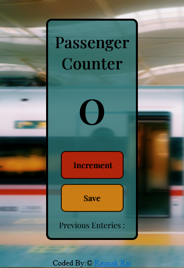
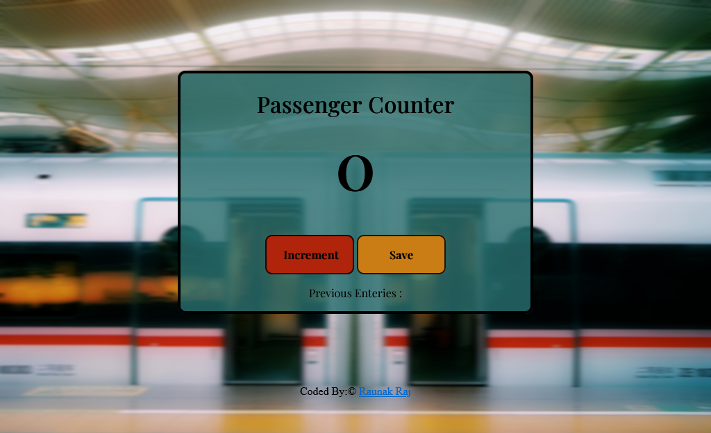

# Scrimba - Passenger Counter

This is my version of the passenger counter challenge by [Scrimba](https://scrimba.com/).Scrimba is great platform to learn frontend development in a interactive way.It helps you to learn coding skills by interacting with the tutorial in real time.

## Table of contents

- [Overview](#overview)
  - [The working](#the-working)
  - [Screenshot](#screenshot)
  - [Links](#links)
- [My process](#my-process)
  - [Built with](#built-with)
  - [Continued development](#continued-development)
  - [Useful resources](#useful-resources)
- [Author](#author)

## Overview

### The working

Users will be able to:

- Count the number of passengers who enters at each stop and save it.
- View the optimal layout depending on their device's screen size
- Interactive elements are user friendly

### Screenshot

### Links

- Code URL: [Github](https://github.com/Raunak40/Passenger_Counter_2.0)
- Live Site URL: [reliable-cucurucho-3acb79](https://reliable-cucurucho-3acb79.netlify.app)

## My process

### Built with

- Semantic HTML5 markup
- CSS custom properties
- Mobile-first workflow
- Basic Javascript properties

### Continued development

There are so many things which I have to continue improve in this site like adding a refresh/reset button, improving background on small viewport, deleting saved entries and saving saved entries on local storage. I am still amature in these fields so I will continue developing them and improve this webpage later.I will also try to learn more semantic HTML tags and Javascript and efficiently use them to make the code more clean and developer friendly.

### Useful resources

- [W3Schools](https://www.w3schools.com) - This site is all in one solution for any programming related queries.
- [Mozilla Developers Network](https://developer.mozilla.org/) 

## Author

- Website - [Raunak Raj](https://reliable-cucurucho-3acb79.netlify.app)
- Frontend Mentor - [@Raunak40](https://www.frontendmentor.io/profile/Raunak40)
- Github - [Raunak40](https://github.com/Raunak40)